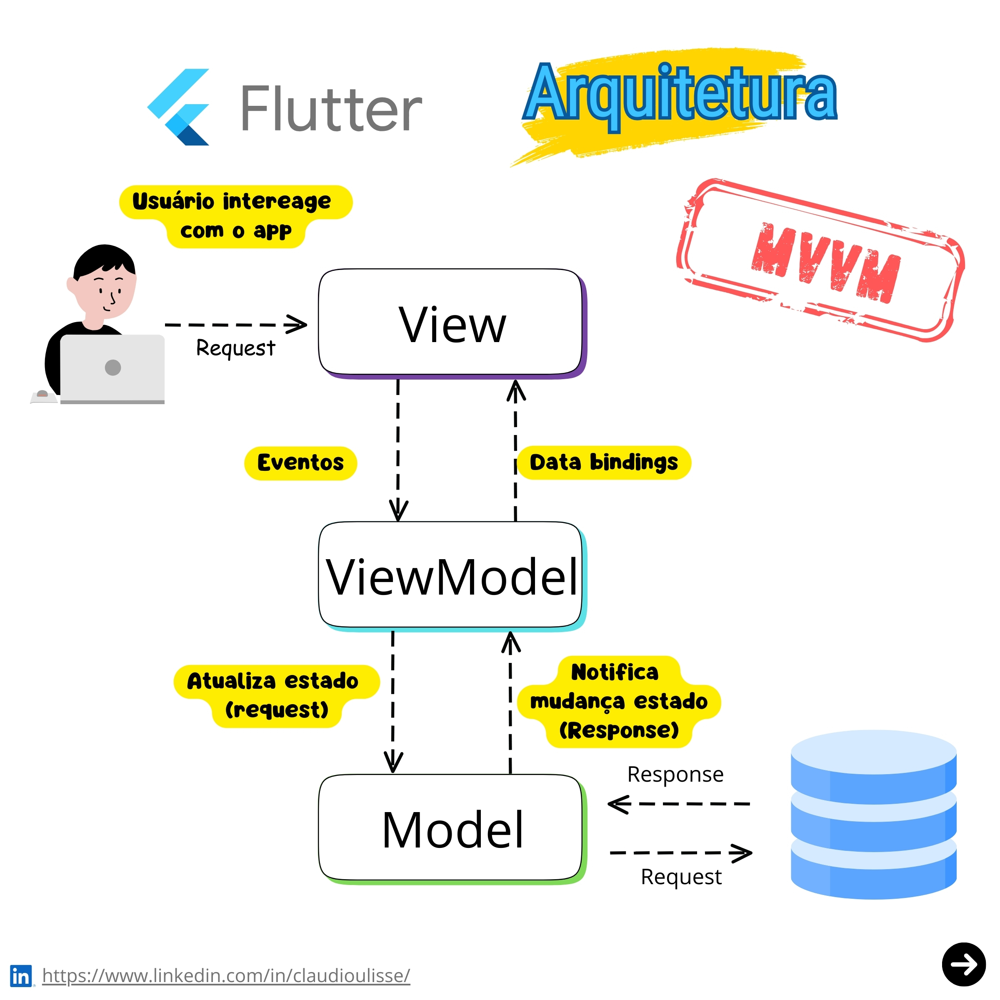

# MVVM 

## 1. Origens e Motivação
A arquitetura **Model-View-ViewModel (MVVM)** surgiu em 2005, desenvolvida pela Microsoft como parte do ecossistema **Windows Presentation Foundation (WPF)** e **Silverlight**. Seu principal idealizador, John Gossman, propôs o padrão para facilitar o desenvolvimento de interfaces gráficas complexas, aproveitando o sistema avançado de **data binding** do WPF. A motivação central era **separar a lógica de negócio da interface do usuário (UI)**, permitindo que designers e desenvolvedores trabalhassem de forma independente (GOSSMAN, 2005).  

A justificativa para o MVVM está na necessidade de:  
1. **Reduzir acoplamento** entre camadas, seguindo o princípio *Separation of Concerns* (SoC).  
2. **Facilitar testes automatizados**, já que a lógica de apresentação (ViewModel) pode ser testada sem a UI.  
3. **Promover reutilização de código**, especialmente em aplicações multiplataforma.  

> :warning: Separation of Concerns (SoC) é um princípio de design que organiza um sistema em partes distintas, cada uma responsável por uma função específica, evitando sobreposição de responsabilidades. O objetivo é simplificar o desenvolvimento, a manutenção e a escalabilidade, isolando lógicas diferentes para reduzir complexidade.UI (View): Cuida da interface do usuário. Lógica de Negócio (Model): Gerencia regras e dados. Controle/Mediação (ViewModel ou Controller): Coordena a interação entre UI e lógica.

Como destacado por Fowler (2004), padrões como o **Presentation Model** influenciaram o MVVM, adaptando-se para cenários com bindings declarativos.  

## 2. Componentes 
1. **Model**:  
   - Representa a camada de dados e regras de negócio.  
   - Responsável por acessar fontes de dados (banco de dados, APIs) e validar informações.  
   - *Exemplo*: Classes que definem entidades como `Usuario` ou `Produto`.  

2. **View**:  
   - Camada de interface do usuário (UI), responsável por exibir dados e capturar interações.  
   - Não contém lógica de negócio, apenas elementos visuais (XAML, HTML).  
   - *Exemplo*: Uma página WPF ou uma tela em Xamarin.Forms.  

3. **ViewModel**:  
   - Atua como intermediário entre a View e o Model.  
   - Expõe propriedades e comandos vinculáveis (*bindables*) para a View, convertendo dados do Model em formatos adequados à UI.  
   - Implementa notificação de mudanças (ex: `INotifyPropertyChanged` no .NET).  
   - *Exemplo*: Uma classe `LoginViewModel` com propriedades `Username` e `CommandLogin`.  

## 3. Como funciona  
1. **View ↔ ViewModel**:  
   - A View se vincula às propriedades e comandos do ViewModel via **data binding**.  
   - Eventos da UI (cliques, inputs) são tratados por comandos (ex: `ICommand`).  

2. **ViewModel ↔ Model**:  
   - O ViewModel consome dados do Model e os formata para a View.  
   - Atualizações no Model podem ser propagadas via callbacks ou padrão Observer.  

3. **Model → ViewModel**:  
   - Notificações de mudanças no Model (ex: atualizações de banco de dados) são refletidas no ViewModel.  

## 4. Fluxo do MVVM
O MVVM opera através de:  
- **Data Binding Bidirecional**: Mantém a sincronização automática entre View e ViewModel.  
- **Comandos**: Encapsulam ações da UI (ex: botão "Salvar") como métodos no ViewModel.  
- **Notificações de Mudança**: O ViewModel atualiza a View quando propriedades mudam (ex: `PropertyChanged`).  

Um exemplo prático é um campo de texto na View vinculado a uma propriedade `Nome` no ViewModel. Quando o usuário edita o campo, o ViewModel atualiza o Model e valida os dados, refletindo erros na UI via bindings.  

---

## Referências  

FOWLER, M. **Patterns of Enterprise Application Architecture**. Boston: Addison-Wesley, 2004.  
MICROSOFT. **The MVVM Pattern**. Microsoft Docs, 2020. Disponível em: <https://docs.microsoft.com/en-us/archive/msdn-magazine/2009/february/patterns-wpf-apps-with-the-model-view-viewmodel-design-pattern>. Acesso em: 15 out. 2023.  
SMITH, J. **Advanced MVVM**. 2. ed. Nova York: Apress, 2012. 
GOSSMAN, J. **Introduction to Model/View/ViewModel pattern for building WPF apps**. Blog pessoal, 2005. Disponível em: <https://blogs.msdn.microsoft.com/johngossman/2005/10/08/introduction-to-modelviewviewmodel-pattern-for-building-wpf-apps/>. Acesso em: 15 out. 2023.  
