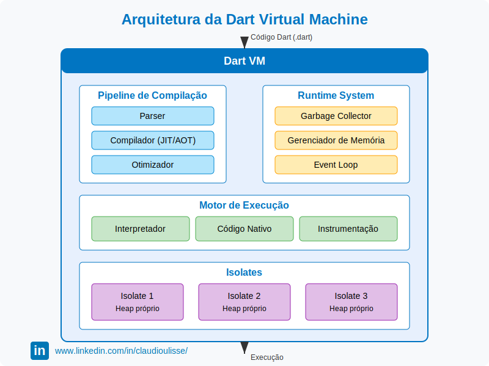
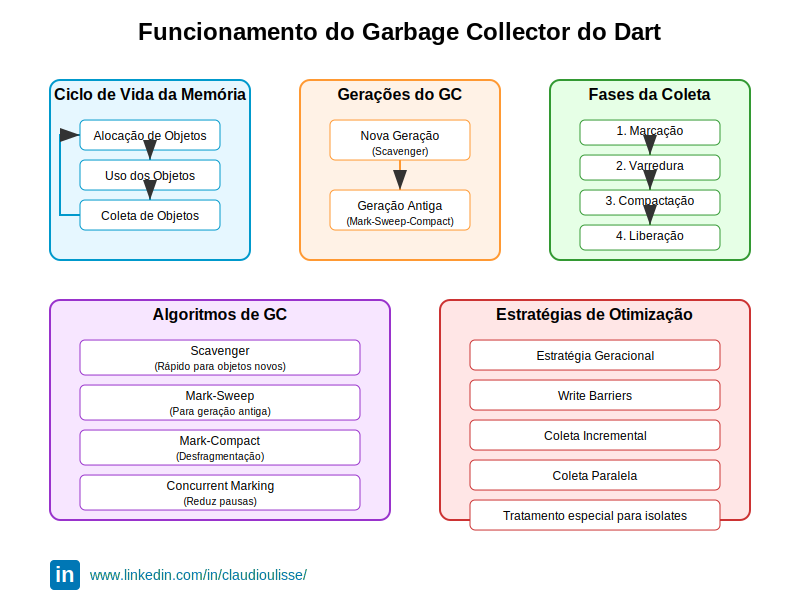

# Arquitetura Dart

## Dart Virtual Machine (Dart VM)

A Dart Virtual Machine é um componente central do ecossistema Dart, responsável por executar código Dart em diferentes contextos e otimizá-lo durante a execução.

### Características principais da Dart VM

1. **Arquitetura de duas camadas**: 
   - **Runtime System**: Gerencia memória, garbage collection e funcionalidades de baixo nível
   - **Core Libraries**: Bibliotecas fundamentais escritas em Dart e implementações nativas

2. **Execução flexível**:
   - VM completa para desenvolvimento e depuração
   - VM compacta (produto) para ambientes de produção

3. **Snapshots**:
   A VM suporta diferentes tipos de snapshots para otimizar inicialização e execução:
   - **Script snapshots**: Código parseado em um formato serializado
   - **App snapshots**: Código e objetos Dart inicializados, prontos para execução
   - **AOT snapshots**: Código compilado para instruções nativas específicas da plataforma
   - **Kernel snapshots**: Representação intermediária usada pelo compilador Dart

4. **Integração com DevTools**:
   A VM fornece APIs de profiling, debugging e instrumentação que alimentam as DevTools do Dart

5. **Suporte a hot reload e hot restart**:
   Permite que desenvolvedores vejam mudanças de código em tempo real sem reiniciar completamente o aplicativo

6. **Plataformas suportadas**:
   A Dart VM roda em diversas plataformas, incluindo:
   - Windows, macOS, Linux
   - iOS e Android (via compilação AOT)
   - Navegadores web (via compilação para JavaScript ou WASM)

### Ciclo de vida da execução na Dart VM

1. O código Dart é transformado em uma representação intermediária (IL)
2. Durante execução, o IL é interpretado inicialmente
3. Código frequentemente executado é identificado (hot spots)
4. Hot spots são compilados Just-In-Time para código nativo otimizado
5. Otimizações específicas são aplicadas com base em dados de tipo e execução

## Compilação AOT e JIT

O Dart oferece flexibilidade através de diferentes modos de compilação, adaptando-se a diversos casos de uso e plataformas.

### Compilação Ahead-of-Time (AOT)

A compilação AOT transforma código Dart em código de máquina nativo antes da execução.

**Vantagens:**

- **Desempenho superior**: Inicialização mais rápida e execução previsível
- **Tamanho de binário reduzido**: Não precisa incluir o compilador JIT
- **Previsibilidade**: Sem pausas para compilação JIT durante execução
- **Segurança**: Código compilado é mais difícil de ser inspecionado ou modificado

**Desvantagens:**

- **Sem hot reload**: Mudanças requerem recompilação completa
- **Específico para plataforma**: Binários diferentes para cada arquitetura
- **Compilação mais lenta**: Processo de compilação mais demorado

**Usos principais:**

- Aplicativos Flutter em produção (iOS, Android)
- Aplicações de linha de comando em produção
- Ambientes onde performance é crítica

### Compilação Just-In-Time (JIT)

A compilação JIT analisa e compila o código durante a execução.

**Vantagens:**

- **Hot reload**: Permite recarregar código alterado sem reiniciar o aplicativo
- **Otimizações em runtime**: Adaptativas com base no uso real
- **Inicialização mais rápida**: Compila apenas o código necessário
- **Melhor para desenvolvimento**: Ciclo de desenvolvimento mais ágil

**Desvantagens:**

- **Overhead de memória**: O compilador precisa estar em memória
- **Desempenho inicial mais baixo**: Código precisa ser compilado primeiro
- **Possíveis pausas**: Durante compilação de código frequentemente usado

**Usos principais:**

- Ambiente de desenvolvimento Flutter
- Dart DevServer para desenvolvimento web
- Testes e depuração

### Compilação para JavaScript (dart2js)

**Características:**

- Compila Dart para JavaScript otimizado
- Suporta todos os recursos da linguagem Dart
- Produz código compatível com todos os navegadores modernos
- Oferece otimizações como tree-shaking (remoção de código não utilizado)

### Comparação técnica dos modos de compilação

| Característica | JIT | AOT | dart2js |
|----------------|-----|-----|---------|
| Tempo de compilação | Rápido | Lento | Médio |
| Tamanho do binário | Grande | Menor | Variável |
| Hot reload | Sim | Não | Limitado |
| Performance | Boa (após warmup) | Excelente | Dependente do JS engine |
| Plataformas | Desenvolvimento | Produção | Web |
| Otimizações específicas | Em tempo real | Em tempo de compilação | Para JS |

## Garbage Collector

O Dart implementa um sistema de coleta de lixo (garbage collection) sofisticado para gerenciar automaticamente a memória, liberando o desenvolvedor dessa responsabilidade.

### Características do GC do Dart

1. **Coleta geracional**:
   - **Geração nova (New)**: Para objetos recém-criados, coletados frequentemente
   - **Geração antiga (Old)**: Para objetos que sobreviveram a várias coletas na geração nova

2. **Algoritmo de marcação e varredura (Mark & Sweep)**:
   - **Fase de marcação**: Identifica objetos alcançáveis
   - **Fase de varredura**: Libera memória de objetos não marcados

3. **Otimização para UI**:
   - **Coletas incrementais**: Divididas em pequenas etapas para evitar pausas perceptíveis na UI
   - **Priorização de frames**: Sincronização com o ciclo de renderização para minimizar jank visual

4. **Técnicas de otimização**:
   - **Write barriers**: Rastreiam mudanças em referências entre objetos
   - **Compactação**: Reorganiza memória para reduzir fragmentação
   - **Promoção seletiva**: Move objetos para geração antiga baseado em heurísticas

5. **Configurabilidade**:
   - Os parâmetros do GC podem ser ajustados para diferentes casos de uso
   - Flags específicas para controlar comportamento em diferentes plataformas

### Ciclo de vida de um objeto em Dart

1. **Alocação**: Objeto é criado no heap na geração nova
2. **Uso**: Aplicação utiliza o objeto através de referências
3. **Potencial promoção**: Se o objeto sobrevive a múltiplas coletas, pode ser promovido para geração antiga
4. **Coleta**: Quando não há mais referências alcançáveis, o objeto é coletado

### Impacto no desempenho e limitações

- **Pausas**: Embora minimizadas, pausas para GC ainda podem ocorrer
- **Previsibilidade**: Menos determinístico que gerenciamento manual de memória
- **Uso de memória**: Geralmente requer mais memória que gerenciamento manual
- **Finalização**: Dependência de finalizers pode causar comportamentos inesperados

## Sound Null Safety

Implementado a partir do Dart 2.12, o Sound Null Safety é um sistema que torna explícita a distinção entre valores que podem ser nulos e valores que nunca podem ser nulos.

### Fundamentos do Sound Null Safety

1. **Princípios básicos**:
   - **Segurança estática**: Erros de nulidade detectados em tempo de compilação
   - **Não-nulidade por padrão**: Variáveis são não-nulas a menos que explicitamente declaradas como anuláveis
   - **Análise de fluxo**: O compilador rastreia o estado de nulidade através do fluxo de execução

2. **Sintaxe**:
   - **Tipo anulável**: `String?` (pode ser String ou null)
   - **Tipo não-nulável**: `String` (nunca pode ser null)
   - **Operador de afirmação não-nulo**: `!` (afirma que um valor anulável não é null)
   - **Operador de navegação segura**: `?.` (acessa propriedades apenas se o objeto não for null)
   - **Operador de atribuição nula**: `??` (fornece valor alternativo se uma expressão for null)

3. **Inicialização segura**:
   - Variáveis devem ser inicializadas antes do uso
   - Análise avançada de fluxo para garantir inicialização correta
   - Campos `late` para inicialização adiada com garantias em tempo de compilação

### Impacto técnico do Sound Null Safety

1. **Otimizações de compilação**:
   - Eliminação de verificações de nulidade em runtime
   - Código mais eficiente sem verificações desnecessárias
   - Redução no tamanho de binários

2. **Segurança**:
   - Eliminação completa de erros de referência nula em código migrado
   - Prevenção de um dos erros mais comuns em programação

3. **Interoperabilidade**:
   - Modo de segurança para interagir com código ainda não migrado
   - Fronteiras de verificação entre código "sound" e "unsound"

4. **Impacto na VM**:
   - Representações otimizadas para tipos não-nulos
   - Eliminação de verificações em runtime

### Desafios e soluções da migração para Null Safety

1. **Migração gradual**:
   - Ferramentas automatizadas para ajudar na migração
   - Análise estática para sugerir correções
   - Compatibilidade entre código migrado e não migrado

2. **Padrões para casos complexos**:
   - Inicialização tardia com `late`
   - Asserções em construtores
   - Factory methods para construção condicional

## Isolates e Concorrência

O modelo de concorrência do Dart é baseado em isolates, uma abordagem que difere significativamente de threads tradicionais e oferece benefícios únicos para aplicações modernas.

### Arquitetura de Isolates

1. **Conceito fundamental**:
   - Cada isolate possui seu próprio heap de memória separado
   - Isolates não compartilham memória diretamente
   - Comunicação exclusivamente por passagem de mensagens

2. **Funcionamento interno**:
   - Cada isolate roda em sua própria thread do sistema operacional
   - Execução do código em um isolate é single-threaded
   - Event loop processa eventos e tarefas assíncronas

3. **Modelos de isolates**:
   - **Isolate pesado**: Isolate completo com todas funcionalidades
   - **Isolate leve**: Versão mais otimizada para tarefas específicas (ainda experimental)

### Comunicação entre Isolates

1. **Portas de envio e recebimento**:
   - `SendPort` e `ReceivePort` formam canais de comunicação unidirecionais
   - Sistema de tipagem para portas oferece segurança adicional

2. **Mecanismos de serialização**:
   - Dados são serializados automaticamente na passagem entre isolates
   - Tipos suportados: primitivos, listas, mapas e objetos simples
   - Funções e closures não podem ser transferidas diretamente

3. **Padrões de comunicação**:
   - Solicitação-resposta com portas pareadas
   - Transmissão para múltiplos receptores
   - Streams de mensagens contínuas

### Assincronia em Dart

1. **Modelo de programação assíncrona**:
   - Baseado em `Future` e `Stream` como abstrações principais
   - `async` e `await` para sintaxe simplificada
   - `Completer` para controle manual de resolução de futures

2. **Event loop**:
   - Fila de microtasks para callbacks de alta prioridade
   - Fila de eventos para I/O, timers e outros eventos
   - Garantias de execução ordenada dentro do mesmo isolate

3. **Interação com isolates**:
   - `Isolate.spawn` para criar novos isolates
   - `compute` (do Flutter) para simplificar operações em isolates separados

### Casos de uso e padrões avançados

1. **Processamento paralelo de dados**:
   - Pool de isolates trabalhadores
   - Divisão de trabalho para tarefas computacionalmente intensivas
   - Agregação de resultados no isolate principal

2. **Isolamento de operações críticas**:
   - Processamento de E/S intensivo em isolates separados
   - Isolamento de operações propensas a falhas
   - Operações de longa duração sem bloquear a UI

3. **Considerações de desempenho**:
   - Custo de criação de isolates
   - Overhead de serialização/deserialização
   - Balanceamento entre número de isolates e recursos do sistema

4. **Padrões emergentes**:
   - Frameworks de atores baseados em isolates
   - Pipelines de processamento com isolates especializados
   - Arquiteturas reativas utilizando isolates e streams

O modelo de isolates do Dart fornece segurança de concorrência com a eliminação de problemas comuns como condições de corrida no acesso à memória compartilhada, ao mesmo tempo que permite aproveitar o processamento paralelo em sistemas multicores modernos. Esta abordagem é particularmente valiosa para aplicações Flutter, onde a responsividade da UI é crítica.

---
Vai para:

- [Sumário](/dart/README.md)
- [Próximo capítulo](/dart/capitulos/primeiro-programa.md)