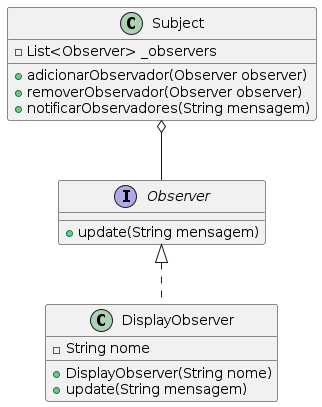

# Eventos

Eventos são como "sinalizadores" no mundo da programação. Imagine um semáforo: ele muda de cor (evento) e os carros reagem a essa mudança. Em programação, eventos funcionam de maneira similar - algo acontece e o sistema responde.

## 1. Fundamentos de Eventos em Dart

### Event Listeners: Ouvindo e Reagindo

Um event listener é como um porteiro atento que espera algo específico acontecer para então agir.

```dart
// Exemplo de event listener simples
class Botao {
  // Função que será chamada quando o botão for clicado
  void Function()? _quandoClicado;

  // Método para registrar o que deve acontecer no clique
  void definirAcaoDeClique(void Function() acao) {
    _quandoClicado = acao;
  }

  // Simula um clique
  void clicar() {
    print('Botão foi pressionado!');
    _quandoClicado?.call(); // Chama a ação registrada
  }
}

void main() {
  var botao = Botao();
  
  // Definindo uma ação específica para o clique
  botao.definirAcaoDeClique(() {
    print('Ação personalizada executada!');
  });

  botao.clicar(); // Dispara o evento
}
```

### Como Funciona:
- `_quandoClicado` é um callback (função de retorno)
- `definirAcaoDeClique` permite definir o que acontece no evento
- `clicar()` dispara o evento

>:warning: Código de exemplo no arquivo [event_listner.dart](../assets/code/event_listener.dart)

## 2. Streams: Fluxo Contínuo de Eventos

Streams são como um rio de eventos: dados fluem continuamente e podem ser processados.

```dart
import 'dart:async';

class SensorDeTemperatura {
  // Controlador que gerencia o fluxo de eventos
  final _controladorTemperatura = StreamController<double>();

  // Expõe o stream para listeners externos
  Stream<double> get temperaturaStream => _controladorTemperatura.stream;

  void adicionarLeitura(double temperatura) {
    if (temperatura > -273.15) { // Temperatura absoluta mínima
      _controladorTemperatura.sink.add(temperatura);
    } else {
      _controladorTemperatura.addError('Temperatura inválida');
    }
  }

  // Importante: sempre feche o controller quando não precisar mais
  void dispose() {
    _controladorTemperatura.close();
  }
}

void main() {
  var sensor = SensorDeTemperatura();

  // Ouvindo o stream de temperaturas
  sensor.temperaturaStream.listen(
    (temp) => print('Nova temperatura: $temp°C'),
    onError: (erro) => print('Erro no sensor: $erro'),
    cancelOnError: false
  );

  // Simulando leituras de temperatura
  sensor.adicionarLeitura(25.5);
  sensor.adicionarLeitura(-300); // Vai gerar um erro
}
```

### Componentes Principais:
- `StreamController`: Gerencia o fluxo de eventos
- `Stream`: Canal por onde os eventos passam
- `Sink`: Ponto de entrada para adicionar eventos

>:warning: Código de exemplo no arquivo [stream_sinks.dart](../assets/code/stream_sinks.dart) e[stream_controller.dart](../assets/code/stream_controller.dart)

## 3. Padrão Observer: Notificação Distribuída

O padrão Observer permite que múltiplos objetos sejam notificados quando algo muda.



```dart
// Interface para observadores
abstract class Observador {
  void atualizar(String mensagem);
}

// Classe que será observada
class Assunto {
  final List<Observador> _observadores = [];

  void adicionarObservador(Observador obs) {
    _observadores.add(obs);
  }

  void removerObservador(Observador obs) {
    _observadores.remove(obs);
  }

  void notificarObservadores(String mensagem) {
    for (var obs in _observadores) {
      obs.atualizar(mensagem);
    }
  }
}

// Implementação de um observador concreto
class Display implements Observador {
  final String nome;
  Display(this.nome);

  @override
  void atualizar(String mensagem) {
    print('$nome recebeu: $mensagem');
  }
}

void main() {
  var sistemaMeteorologico = Assunto();

  var display1 = Display('Tela Principal');
  var display2 = Display('Painel Externo');

  sistemaMeteorologico.adicionarObservador(display1);
  sistemaMeteorologico.adicionarObservador(display2);

  // Notifica todos os observadores
  sistemaMeteorologico.notificarObservadores('Alerta: Chuva prevista!');
}
```


## Boas Práticas

1. **Sempre feche StreamControllers** para evitar vazamentos de memória
2. Trate erros em streams usando `.listen()` com tratamento de erro
3. Use streams para operações assíncronas
4. Mantenha os listeners focados e específicos
5. Prefira comunicação desacoplada com o padrão Observer

>:warning: Código de exemplo no arquivo [observer.dart](../assets/code/observer.dart)

---
Vai para:
- [Sumário](https://github.com/claulis/flutter/blob/main/dart/README.md)
- [Próximo capítulo](../capitulos/tratamento-erros-excecoes.md)


