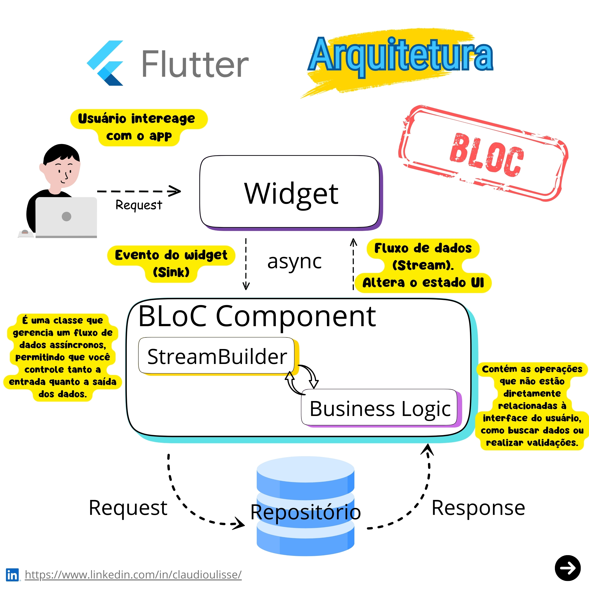

# BLoC

## 1. Origens e Motivação
A arquitetura **BLoC (Business Logic Component)** foi proposta pelo time do Google em **2018**, durante o **DartConf**, como um padrão para gerenciamento de estado em aplicações **Flutter**. Criada por desenvolvedores como Paolo Soares e Cong Hui, a motivação central foi **separar a lógica de negócio da interface do usuário**, utilizando os princípios da programação reativa com **Streams** e **Sinks** (GOOGLE, 2018).

> :warning: A programação reativa é um paradigma de desenvolvimento focado em fluxos de dados (streams) e na propagação automática de mudanças. Seu objetivo é simplificar o tratamento de eventos assíncronos (como interações do usuário, respostas de APIs) e garantir que o sistema reaja dinamicamente a atualizações.

A justificativa para sua adoção inclui:  
1. **Centralização do estado**: Evitar dispersão da lógica de negócio em widgets.  
2. **Reatividade**: Facilitar atualizações dinâmicas da UI com base em mudanças de estado.  
3. **Reutilização**: Permitir que a mesma lógica seja usada em diferentes plataformas (mobile, web).  

Como destacado por Soares (2019), o BLoC foi inspirado em padrões como **Redux** e **MVVM**, adaptando-se à filosofia declarativa do Flutter.  

## 2. Componentes
1. **Eventos (Events)**:  
   - Ações disparadas pela UI (ex.: clique em um botão).  
   - Representam entradas que modificam o estado.  

2. **BLoC (Business Logic Component)**:  
   - Recebe eventos, processa a lógica de negócio e emite novos estados.  
   - Usa `Streams` para gerenciar o fluxo de dados e `Sinks` para entrada de eventos.  

3. **Estado (State)**:  
   - Representa a condição atual da aplicação após o processamento de um evento.  
   - Exemplo: `Carregando`, `DadosCarregados`, `Erro`.  

4. **UI (Camada de Apresentação)**:  
   - Widgets que consomem estados do BLoC e atualizam a interface.  
   - Utiliza `BlocBuilder` ou `BlocListener` para reagir a mudanças.  

## 3. Como funciona

1. **Fluxo de Dados**:  
   - **UI → Evento**: A interface dispara um evento (ex.: `FetchDataEvent`).  
   - **BLoC**: Processa o evento, interage com serviços (API, banco de dados) e emite um novo estado (ex.: `LoadingState` → `SuccessState`).  
   - **Estado → UI**: A UI é reconstruída com base no novo estado.  

2. **Ferramentas**:  
   - Pacotes como `flutter_bloc` e `bloc` simplificam a implementação.  
   - `mapEventToState`: Método central do BLoC para converter eventos em estados.  

 

## Referências 

GOOGLE. **BLoC: Business Logic Component**. Flutter Documentation, 2020. Disponível em: <https://flutter.dev/docs/development/data-and-backend/state-mgmt/options#bloc--rx>. Acesso em: 15 out. 2023.  
SOARES, P.; HUI, C. **Reactive State Management with BLoC**. DartConf 2018. Disponível em: <https://www.youtube.com/watch?v=PLHln7wHgPE>. Acesso em: 15 out. 2023.  
FELIPE, L. **Flutter na Prática**. 1. ed. São Paulo: Casa do Código, 2020.  
FLOYD, R. **Gerenciamento de Estado no Flutter**. Medium, 2021. Disponível em: <https://medium.com/flutter-community>. Acesso em: 15 out. 2023.  
