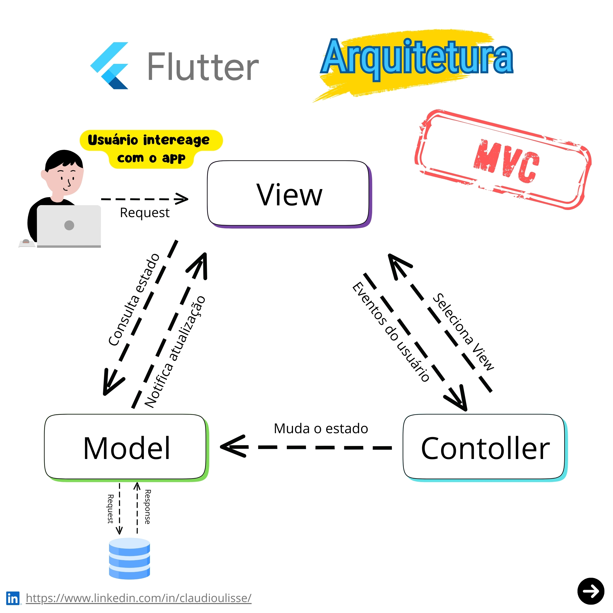

# MVC (Model-View-Controller)

## Origens e motivação
De acordo com Reenskaug (2003), o padrão MVC teve sua origem em 1978, quando o autor o introduziu durante seu trabalho no Xerox PARC. Conforme documentado por Kay (1993), o contexto histórico era marcado por desafios significativos no desenvolvimento do Smalltalk-76, especialmente relacionados à complexidade crescente das interfaces gráficas.

Segundo Krasner e Pope (1988), a motivação fundamental para o desenvolvimento do MVC surgiu da necessidade de separar as preocupações em diferentes camadas do software. Os autores utilizam uma analogia musical para ilustrar o conceito: o instrumento (Model) produz o som, a partitura (View) mostra como a música deve ser tocada, e o músico (Controller) interpreta a partitura e manipula o instrumento.

## Justificativa
Gamma et al. (1994) explicam que o MVC se justifica por diversos benefícios fundamentais, sendo a separação de responsabilidades o princípio mais crucial. De acordo com os autores, esta separação resolve o problema da mistura entre interface do usuário, lógica de negócios e acesso a dados, dividindo estas responsabilidades em três componentes distintos:

Como descrito por Fowler (2002), o Model representa os dados e as regras de negócio. Martin (2017) exemplifica isso através de um sistema bancário, onde o Model contém as regras de transferência, independentemente da interface.

Buschmann et al. (1996) definem a View como o componente responsável pela apresentação, enfatizando que ela não possui conhecimento sobre os cálculos realizados, apenas sobre como mostrar os resultados.

Freeman et al. (2020) caracterizam o Controller como um maestro que coordena as interações entre o Model e a View, gerenciando o fluxo de dados e ações do usuário.

Bass, Clements e Kazman (2012) destacam os benefícios práticos desta arquitetura:
- Manutenibilidade
- Reusabilidade
- Testabilidade
- Desenvolvimento paralelo

De acordo com Sommerville (2016), o MVC evoluiu ao longo do tempo e inspirou variantes como MVP e MVVM, mantendo sempre seu princípio central de separação de responsabilidades.

## Como funciona

O padrão arquitetural Model-View-Controller (MVC) é um dos mais influentes na engenharia de software. Segundo Gamma et al. (1994), este padrão divide a aplicação em três componentes principais, cada um com responsabilidades específicas e bem definidas.
De acordo com Fowler (2002), os componentes do MVC são:

### 1. Model (Modelo)
Como explica Martin (2017), o Model é o coração da aplicação, responsável por:
 - Encapsular os dados do sistema
 - Implementar a lógica de negócio
 - Manter as regras de validação

### 2. View (Visão)
Buschmann et al. (1996) definem a View como a camada de apresentação, que:
 - Exibe informações ao usuário
 - Recebe entrada de dados
 - Não contém lógica de negócio

### 3. Controller (Controlador)
Segundo Sommerville (2016), o Controller atua como intermediário entre Model e View:
 - Recebe as ações do usuário da View
 - Processa estas ações usando o Model
 - Seleciona a View apropriada para resposta

Bass, Clements e Kazman (2012) explicam que o fluxo de funcionamento típico do MVC segue esta sequência:
- Usuário interage com a View (ex: clica em um botão)
- View notifica o Controller sobre a ação
- Controller processa a ação utilizando o Model
- Model atualiza seu estado e notifica as mudanças
- Controller seleciona a View apropriada
- View é atualizada com os novos dados

## Referências:
BASS, L.; CLEMENTS, P.; KAZMAN, R. Software architecture in practice. 3. ed. Boston: Addison-Wesley, 2012.
BUSCHMANN, F. et al. Pattern-oriented software architecture: a system of patterns. Chichester: Wiley, 1996.
FOWLER, M. Patterns of enterprise application architecture. Boston: Addison-Wesley, 2002.
FREEMAN, E. et al. Head first design patterns. 2. ed. Sebastopol: O'Reilly Media, 2020.
GAMMA, E. et al. Design patterns: elements of reusable object-oriented software. Boston: Addison-Wesley, 1994.
KAY, A. The early history of Smalltalk. ACM SIGPLAN Notices, v. 28, n. 3, p. 69-95, 1993.
KRASNER, G. E.; POPE, S. T. A cookbook for using the model-view controller user interface paradigm in Smalltalk-80. Journal of Object-oriented Programming, v. 1, n. 3, p. 26-49, 1988.
MARTIN, R. C. Clean architecture: a craftsman's guide to software structure and design. Boston: Prentice Hall, 2017.
REENSKAUG, T. The Model-View-Controller (MVC) - Its Past and Present. Oslo: University of Oslo, 2003.
SOMMERVILLE, I. Software engineering. 10. ed. Harlow: Pearson Education, 2016.

