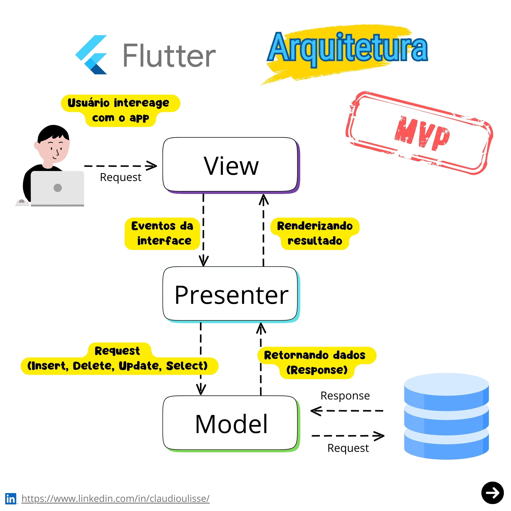

# MVP (Model-View-Presenter) 

## Origens e Motivação  
A arquitetura **MVP** (*Model-View-Presenter*) surgiu como uma evolução do padrão **MVC** (*Model-View-Controller*), buscando resolver limitações relacionadas à separação de responsabilidades e testabilidade em interfaces gráficas. Foi formalizada na década de 1990 por Mike Potel durante seu trabalho na Taligent, uma subsidiária da IBM, com o objetivo de aprimorar o desenvolvimento de aplicações complexas em linguagens como C++ e Java (POTEL, 1996). O MVP foi inicialmente aplicado em sistemas desktop, mas ganhou relevância em frameworks modernos, como Android e Windows Forms, devido à sua capacidade de isolar a lógica de apresentação da interface do usuário (MICROSOFT, 2008).  
A principal motivação para a criação do MVP foi a necessidade de **separação clara entre a camada de interface (View)** e a **lógica de negócios (Model)**. Em sistemas baseados em GUI (*Graphical User Interface*), como aplicações desktop e mobile, a interação entre interface e lógica de negócios tende a gerar acoplamento excessivo, dificultando a manutenção e testes. O MVP introduziu o **Presenter** como intermediário, responsável por processar eventos da View e atualizar o Model, garantindo que a interface não manipulasse diretamente os dados (FOWLER, 2002).  

Além disso, a arquitetura MVP foi impulsionada pela demanda por **testabilidade**. Ao isolar a lógica de apresentação no Presenter, tornou-se possível criar testes unitários sem depender de elementos visuais, um avanço significativo para ambientes de desenvolvimento ágil (GAMMA et al., 1994).  

## Justificativa
A adoção do MVP justifica-se por três fatores principais:  

1. **Redução de Acoplamento**:  
   O MVP promove a separação entre a interface (View) e a lógica de negócios (Model), permitindo que alterações na UI não impactem o núcleo do sistema. Isso é crítico em projetos com interfaces dinâmicas, como aplicações multiplataforma (POTEL, 1996).  

2. **Facilidade de Testes**:  
   Como o Presenter atua como uma camada intermediária, é possível testar a lógica de apresentação sem executar a interface gráfica, acelerando ciclos de desenvolvimento e reduzindo erros (FOWLER, 2002).  

3. **Adaptabilidade**:  
   A arquitetura MVP permite a reutilização do Model e do Presenter em diferentes Views, como em versões mobile e desktop de uma mesma aplicação, otimizando recursos e tempo de desenvolvimento (MICROSOFT, 2008).  

## Como funciona 

O padrão **MVP** (*Model-View-Presenter*) é uma arquitetura de software que organiza o código em três componentes principais, cada um com responsabilidades bem definidas, promovendo a separação de preocupações (*separation of concerns*) e facilitando a manutenção e testabilidade. 
### 1. **Model**:  
   - **Responsabilidade**: Representa a camada de dados e a lógica de negócios da aplicação.  
   - **Exemplo**: Classes que acessam bancos de dados, realizam cálculos ou implementam regras de negócio.  
   - **Característica**: Independente da interface do usuário (UI) e do Presenter.  

### 2. **View**:  
   - **Responsabilidade**: Gerencia a interface gráfica, exibindo dados e capturando interações do usuário (cliques, inputs, etc.).  
   - **Exemplo**: Activity no Android, formulário em Windows Forms ou componente em Angular.  
   - **Característica**: Passiva, ou seja, não contém lógica de negócios, apenas delega ações ao Presenter.  

### 3. **Presenter**:  
   - **Responsabilidade**: Atua como intermediário entre a View e o Model. Processa eventos da View, atualiza o Model e reflete mudanças na View.  
   - **Exemplo**: Classe que recebe eventos de clique, valida dados e atualiza a interface.  
   - **Característica**: Contém a lógica de apresentação, mas não depende diretamente de frameworks de UI.  

### Fluxo 
O fluxo de interação no MVP segue estas etapas:  

1. **Evento na View**:  
   - O usuário interage com a View (ex.: clica em um botão).  
   - A View notifica o Presenter sobre o evento, **sem processar a lógica**.  

2. **Processamento no Presenter**:  
   - O Presenter recebe o evento, valida dados (se necessário) e solicita atualizações ao Model.  
   - Exemplo: O Presenter chama um método do Model para buscar dados de um banco.  

3. **Atualização do Model**:  
   - O Model executa a lógica de negócios (ex.: consulta um banco de dados) e retorna resultados ao Presenter.  

4. **Atualização da View**:  
   - O Presenter recebe os dados do Model e atualiza a View, geralmente por meio de uma interface (contrato) que a View implementa.  
   - Exemplo: O Presenter chama `view.mostrarDados(dados)` para exibir informações na tela.  

## Referências

POTEL, M. **MVP: Model-View-Presenter – The Taligent Programming Model for C++ and Java**. Taligent, 1996. Disponível em: [https://www.wildcrest.com/Potel/Portfolio/mvp.pdf](https://www.wildcrest.com/Potel/Portfolio/mvp.pdf). Acesso em: 15 out. 2023. 
FOWLER, M. **Patterns of Enterprise Application Architecture**. 1. ed. Boston: Addison-Wesley, 2002.  
GAMMA, E. et al. **Design Patterns: Elements of Reusable Object-Oriented Software**. 1. ed. Boston: Addison-Wesley, 1994. 
LARMAN, C. **Applying UML and Patterns: An Introduction to Object-Oriented Analysis and Design and Iterative Development**. 3. ed. Nova Jersey: Prentice Hall, 2004.   
MICROSOFT. **The Model-View-Presenter Pattern**. MSDN Library, 2008. Disponível em: [https://learn.microsoft.com](https://learn.microsoft.com). Acesso em: 15 out. 2023.  
REIS, E. **The Lean Startup: Como os Empreendedores Atuais Utilizam a Inovação Contínua para Criar Empresas Extremamente Bem-sucedidas**. 1. ed. São Paulo: Leya, 2011.  

